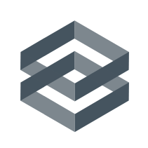

<!-- PROJECT SHIELDS -->
<!--
*** Using markdown "reference style" links for readability.
*** Reference links are enclosed in brackets [ ] instead of parentheses ( ).
*** See the bottom of this document for the declaration of the reference variables
*** for contributors-url, forks-url, etc. This is an optional, concise syntax you may use.
*** https://www.markdownguide.org/basic-syntax/#reference-style-links
-->
[![Contributors][contributors-shield]][contributors-url]
[![Forks][forks-shield]][forks-url]
[![Stargazers][stars-shield]][stars-url]
[![Issues][issues-shield]][issues-url]
[![MIT License][license-shield]][license-url]
[![LinkedIn][linkedin-shield]][linkedin-url]


<!-- PROJECT LOGO -->
<br />
<p align="center">
  <a href="https://github.com/edgebox-iot">
    
  </a>

  <h3 align="center">Edgebox Control Module</h3>

  <p align="center">
    A System Control module written in Go. Its resonsability is to configure dependencies and perform system tasks, automatically in a schedule, or by command.
    <br />
    <a href="https://github.com/github_username/edgeboxctl"><strong>Explore the docs »</strong></a>
    <br />
    <br />
    <a href="https://github.com/github_username/edgeboxctl/issues">Report Bug</a>
    ·
    <a href="https://github.com/github_username/edgeboxctl/issues">Request Feature</a>
  </p>
</p>


<!-- TABLE OF CONTENTS -->
## Table of Contents

- [Table of Contents](#table-of-contents)
- [About The Project](#about-the-project)
  - [Built With](#built-with)
- [Getting Started](#getting-started)
  - [Prerequisites](#prerequisites)
  - [Installation](#installation)
- [Usage](#usage)
- [Roadmap](#roadmap)
- [Contributing](#contributing)
- [License](#license)


<!-- ABOUT THE PROJECT -->
## About The Project

[![Edgebox Screen Shot][product-screenshot]](https://edgebox.co)

Edgebox is a small box that connects alongside your home internet router. It brings powerful features that go alongside or can even completely replace various services that you already use in the day-to-day.


### Built With

* [Go Lang](https://golang.org/)
* [SH](https://en.wikipedia.org/wiki/Bourne_shell)
* [Lots of Love <3](https://edgebox.co/team)


<!-- GETTING STARTED -->
## Getting Started

To get a local copy up and running follow these simple steps.

### Prerequisites

If you're installing this to run natively in the system, you better be doing it inside of the [Development Virtual Machine](https://github.com/edgebox-iot/devm). This software can do destructive action in the system is is running. You've been warned.

If you're running for development purposes, a Docker container suffices, so make sure you have:
* Docker
* Docker Compose
```sh
sudo apt-get install docker docker-compose
```

Check the following links for more info on [Docker](https://www.docker.com/) and [Docker Compose](https://docs.docker.com/compose/).

Aditionally, edgeboxctl needs the following bash commands available wherever it runs:
* `sh`
* `rm`
* `systemctl`
* `lsblk`
* `yq`
* `tinc-boot` _(not mandatory)_

### Installation

1. Clone the repo
```sh
git clone https://github.com/edgebox-iot/edgeboxctl.git
```
2. Run Docker-Compose
```sh
docker-compose up
```


<!-- USAGE EXAMPLES -->
## Usage

_For more examples, please refer to the [Documentation](https://github.com/edgebox-iot/docs/)_


<!-- ROADMAP -->
## Roadmap

See the [open issues](https://github.com/edgebox-iot/edgeboxctl/issues) for a list of proposed features (and known issues).


<!-- CONTRIBUTING -->
## Contributing

Contributions are what make the open source community such an amazing place to be learn, inspire, and create. Any contributions you make are **greatly appreciated**.

1. Fork the Project
2. Create your Feature Branch (`git checkout -b feature/AmazingFeature`)
3. Commit your Changes (`git commit -m 'Add some AmazingFeature'`)
4. Push to the Branch (`git push origin feature/AmazingFeature`)
5. Open a Pull Request


<!-- LICENSE -->
## License

Distributed under the MIT License. See `LICENSE` for more information.


<!-- MARKDOWN LINKS & IMAGES -->
<!-- https://www.markdownguide.org/basic-syntax/#reference-style-links -->
[contributors-shield]: https://img.shields.io/github/contributors/edgebox-iot/edgeboxctl.svg?style=flat-square
[contributors-url]: https://github.com/edgebox-iot/edgeboxctl/graphs/contributors
[forks-shield]: https://img.shields.io/github/forks/edgebox-iot/edgeboxctl.svg?style=flat-square
[forks-url]: https://github.com/edgebox-iot/edgeboxctl/network/members
[stars-shield]: https://img.shields.io/github/stars/edgebox-iot/edgeboxctl.svg?style=flat-square
[stars-url]: https://github.com/edgebox-iot/edgeboxctl/stargazers
[issues-shield]: https://img.shields.io/github/issues/edgebox-iot/edgeboxctl.svg?style=flat-square
[issues-url]: https://github.com/edgebox-iot/edgeboxctl/issues
[license-shield]: https://img.shields.io/github/license/edgebox-iot/edgeboxctl.svg?style=flat-square
[license-url]: https://github.com/edgebox-iot/edgeboxctl/blob/master/LICENSE.txt
[linkedin-shield]: https://img.shields.io/badge/-LinkedIn-black.svg?style=flat-square&logo=linkedin&colorB=555
[linkedin-url]: https://linkedin.com/in/edgebox-iot
